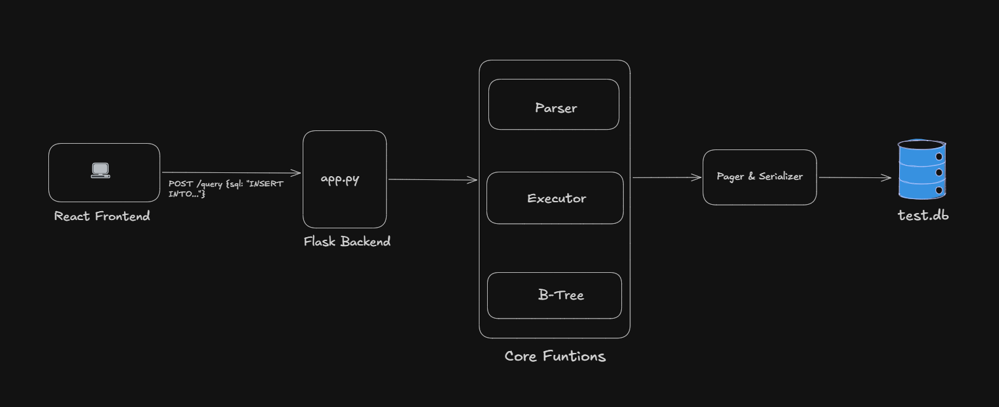

# 🗄️ SQLite Clone — A Hand-Built Database Engine

<p align="center">
  
</p>

A functional, educational database engine built from scratch in Python, featuring a bespoke B-Tree implementation, a custom Lexical SQL Parser, and a modern React (Vite) Frontend. 

Data gets stored in a binary file on disk. No ORMs. No external database libraries. Just code.

---

## 🏗️ Architecture & How It Works

This project implements the core ideas behind how production databases like SQLite work internally:

1. **React (Vite) Frontend**: An interactive UI to execute queries and visualize the engine's step-by-step execution.
2. **Flask Backend API**: Receives SQL queries and routes them to the database engine.
3. **Lexical SQL Parser**: Reads raw SQL strings, validates the grammar, and breaks them down into Abstract Syntax Trees (ASTs).
4. **Query Executor**: The glue layer that takes the AST intent and routes it to the specific B-Tree read/write operations.
5. **B-Tree Indexing Engine**: Manages the storage structure. Handles node splitting at capacity and ensures O(log n) performance for Primary Key searches.
6. **Disk Pager & Serializer**: Manages memory-to-disk translation via struct packing. Converts Python dictionaries into 4KB aligned bytes and writes them directly to `test.db`.

---

## ⚡ Supported SQL

The engine currently robustly supports the core CRUD paradigm:

```sql
CREATE TABLE users (id, name, age)

INSERT INTO users VALUES (1, 'Alice', 25)

SELECT * FROM users

SELECT * FROM users WHERE id = 1
```

*(Note: `DELETE` operations via a Lazy Deletion strategy are on the roadmap).*

---

## 🛠️ Tech Stack

**Core Engine:**
- 100% Python 3.11+
- `struct` module for byte-level memory alignment
- `pytest` for unit testing the B-Tree and execution layers

**API & Frontend:**
- Flask & Gunicorn (Backend)
- React.js + Vite (Frontend)
- Custom CSS for a premium, interactive "glassmorphic" UI

---

## 🚀 Running Locally

### 1. Start the Python Backend
```bash
# Clone the repository
git clone https://github.com/YOUR_USERNAME/sqlite-clone.git
cd sqlite-clone

# Create and activate a virtual environment
python -m venv venv
source venv/bin/activate        # Mac/Linux
venv\Scripts\activate           # Windows

# Install dependencies
pip install -r requirements.txt

# Start the Flask API
python web/app.py
```

### 2. Start the Vite React Frontend
Open a **new terminal window**:
```bash
cd sqlite-clone/web-ui
npm install
npm run dev
```
Then open `http://localhost:5173` in your browser.

---

## 🧪 Running Core Tests

To verify the integrity of the B-Tree, Parser, and Pager components:
```bash
pytest tests/
```

---

## 📖 Why I Built This

I wanted to truly understand how databases actually work under the hood—not just how to query them. Most developers use databases every day without knowing what happens between pressing `Enter` and a record persisting on disk. Building the Lexer, B-Tree, and Pager from scratch demystifies that magic.